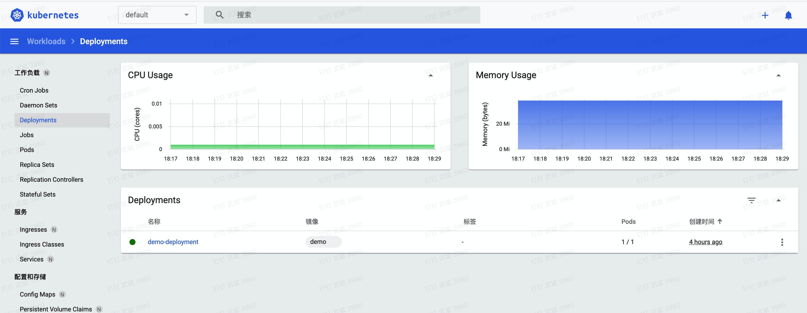
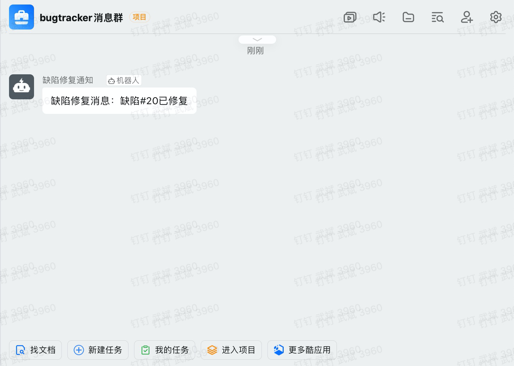
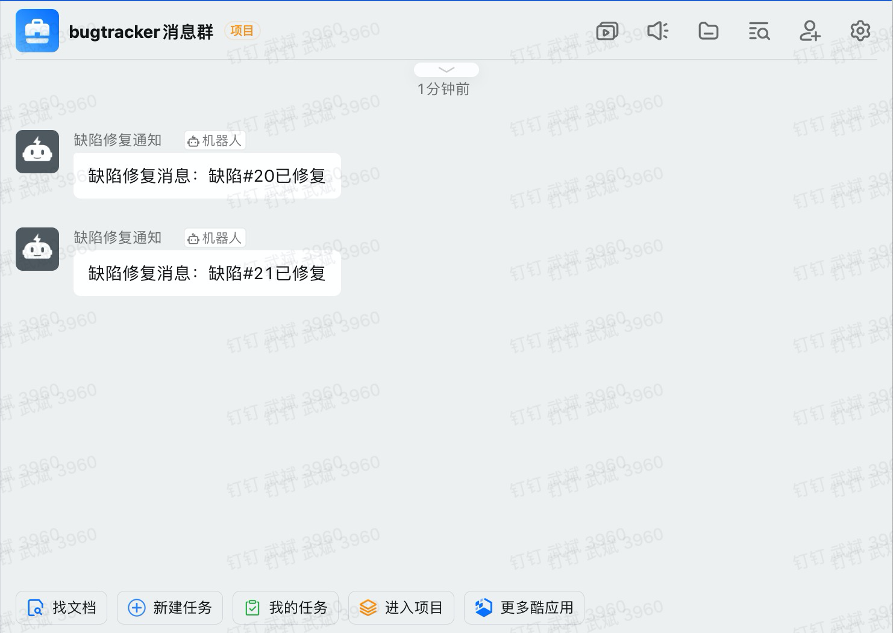
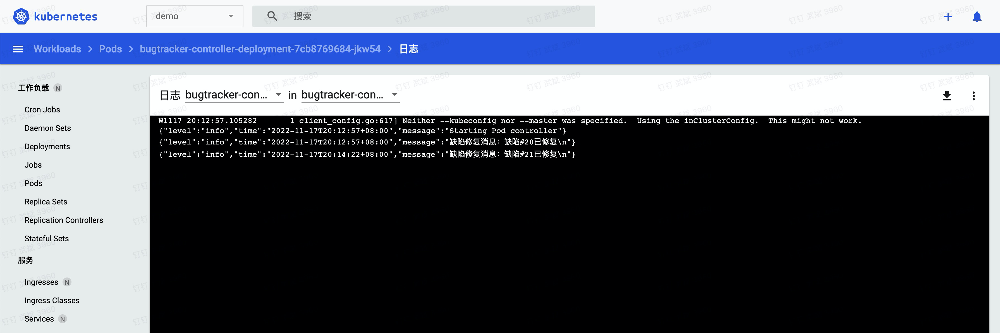
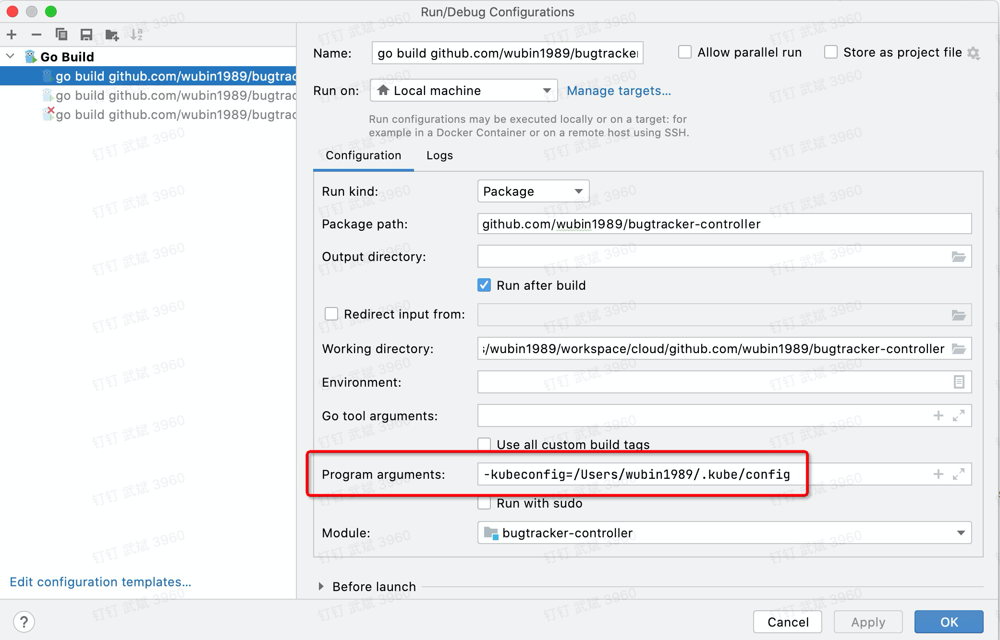

# 缺陷跟踪自定义控制器

缺陷跟踪自定义控制器是一个Go语言的演示如何开发kubernetes自定义控制器的demo项目。

## 业务需求

业务相关的服务修复缺陷并部署到k8s集群后，通过k8s自定义控制器服务自动发送钉钉机器人消息到钉钉群，通知相关人员XXX缺陷已修复。

## 环境要求

- golang版本: >=go1.18
- 开发框架：go-doudou v2.0.1
- kubernetes环境: [minikube](https://minikube.sigs.k8s.io/docs/start/)
- 钉钉群和配置好webhook的钉钉机器人

## 项目结构

本项目包括两个部分：demo服务和自定义控制器。

### demo服务

在`demo`文件夹中，采用开源的go语言微服务框架go-doudou开发。请参考[go-doudou官方文档](https://go-doudou.unionj.cloud/guide/getting-started.html)。

demo服务是一个RESTful服务，提供了一个`GET`请求的`/health`接口，返回json格式的响应数据。部署的时候通过修改`demo_deployment.yaml`文件中的`a8r.io/bugs`注解，
来触发自定义控制器的消息推送。

### 自定义控制器

```shell
.
├── Dockerfile
├── README.md
├── bugtrackercontroller_deployment.yaml        # 自定义控制器的k8s deployment部署文件
├── demo                                        # demo服务
├── go.mod
├── go.sum
├── main.go                                     # 自定义控制器的入口文件
└── serviceaccount                              # 创建Service Account相关k8s配置文件
    ├── bug-tracker-role.yaml
    ├── bug-tracker.yaml
    └── role-binding.yaml

7 directories, 18 files
```

## 开发调试

### 启动demo服务

1. 打包docker镜像

```shell
go-doudou svc push 
```

2. 部署到minikube

```shell
go-doudou svc deploy
```

3. 打开minikube控制台

```shell
➜  demo minikube dashboard
🤔  正在验证 dashboard 运行情况 ...
🚀  Launching proxy ...
🤔  正在验证 proxy 运行状况 ...
🎉  Opening http://127.0.0.1:64744/api/v1/namespaces/kubernetes-dashboard/services/http:kubernetes-dashboard:/proxy/ in your default browser...
```

可以看到服务已经成功部署。



### 启动bugtracker自定义控制器

1. 将钉钉机器人的webhook配置到`.env`文件中的`DINGTALK_WEBHOOK`环境变量

2. 打包docker镜像

```shell
docker build -t bugtracker-controller . 
```

3. 每次重新打包镜像以后，都需要打版本标签

```shell
docker tag bugtracker-controller bugtracker-controller:v1
```

4. 修改`bugtrackercontroller_deployment.yaml`文件中的`image`配置为最新的镜像名称，包括版本标签

```yaml
apiVersion: apps/v1
kind: Deployment
metadata:
  name: bugtracker-controller-deployment
  namespace: demo
spec:
  replicas: 1
  selector:
    matchLabels:
      app: bugtracker-controller
  template:
    metadata:
      labels:
        app: bugtracker-controller
    spec:
      containers:
      - image: bugtracker-controller:v5
...
```

5. 部署自定义控制器之前，必须先创建好Service Account，否则没有权限调用k8s API

首先，创建命名空间`demo`

```shell
kubectl create namespace demo
```

其次，创建`ServiceAccount`

```shell
kubectl apply -f serviceaccount/bug-tracker.yaml
```

再创建`ClusterRole`

```shell
kubectl apply -f serviceaccount/bug-tracker-role.yaml
```

最后创建`ClusterRoleBinding`

```shell
kubectl apply -f serviceaccount/role-binding.yaml
```

6. 部署自定义控制器

```shell
kubectl apply -f bugtrackercontroller_deployment.yaml
```

此时，钉钉群里会收到一条消息`缺陷修复消息：缺陷#20已修复`



7. 将`demo/demo_deployment.yaml`文件中的注解`a8r.io/bugs`的值改成`"#14"`，再重新部署

```shell
cd demo && go-doudou svc deploy
```

此时，钉钉群里会收到一条消息`缺陷修复消息：缺陷#21已修复`



我们还可以在控制台看到类似如下截图中的日志输出。



### 在goland中debug

如果想在goland中调试，需要设置命令行参数`-kubeconfig=/Users/wubin1989/.kube/config`，需要将`/Users/wubin1989`改成你本地的home路径。



